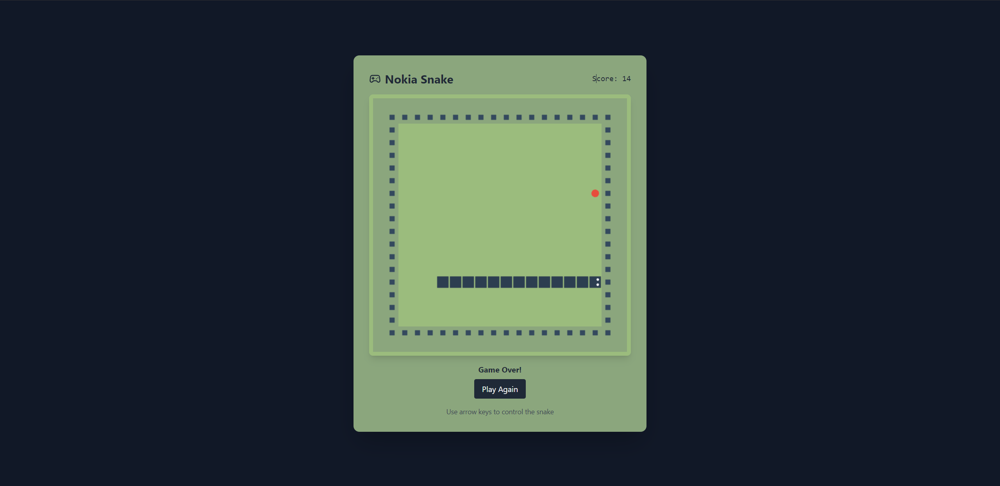

# Nokia Snake Game

A modern recreation of the classic Nokia Snake game using Three.js, React, and TypeScript. This project features a 3D rendered game environment while maintaining the nostalgic feel of the original game.



## Features

- 🎮 Classic snake gameplay with modern 3D graphics
- 🎨 Beautiful Three.js rendered environment
- 🎯 Bonus food system with extra points
- 👀 Animated snake eyes that follow movement
- 🏗️ Clear game boundaries with 3D walls
- 📱 Responsive design
- 🎯 Score tracking system

## Tech Stack

- React
- TypeScript
- Three.js
- Vite
- Tailwind CSS

## Getting Started

### Prerequisites

- Node.js (version 14 or higher)
- npm or yarn

### Installation

1. Clone the repository
```bash
git clone https://github.com/yourusername/nokia-snake-threejs.git
cd nokia-snake-threejs
```

2. Install dependencies
```bash
npm install
# or
yarn install
```

3. Start the development server
```bash
npm run dev
# or
yarn dev
```

4. Open your browser and navigate to `http://localhost:5173`

## How to Play

1. Press any arrow key to start the game
2. Use arrow keys to control the snake's direction:
   - ⬆️ Up Arrow: Move up
   - ⬇️ Down Arrow: Move down
   - ⬅️ Left Arrow: Move left
   - ➡️ Right Arrow: Move right
3. Collect food to grow the snake and earn points:
   - Regular food (red): 1 point
   - Bonus food (yellow): 5 points
4. Avoid hitting the walls or the snake's own body
5. Try to achieve the highest score possible!

## Game Features

### Scoring System
- Regular food gives 1 point
- Bonus food appears randomly (20% chance) and gives 5 points
- Score is displayed at the top of the game

### Visual Elements
- 3D rendered game environment
- Snake eyes that follow movement direction
- Clear boundary walls
- Distinct regular and bonus food appearances
- Modern UI with game status indicators

## Development

### Project Structure
```
src/
  ├── game/
  │   ├── Scene.tsx        # Three.js rendering
  │   ├── useGameLogic.ts  # Game mechanics
  │   ├── constants.ts     # Game constants
  │   └── types.ts         # TypeScript types
  ├── App.tsx             # Main game component
  └── main.tsx           # Entry point
```

### Building for Production

```bash
npm run build
# or
yarn build
```

The built files will be in the `dist` directory.

## Contributing

Contributions are welcome! Please feel free to submit a Pull Request.

## License

This project is licensed under the MIT License - see the [LICENSE](LICENSE) file for details.

## Acknowledgments

- Original Nokia Snake game for inspiration
- Three.js community for 3D rendering capabilities
- React and TypeScript communities for excellent development tools
